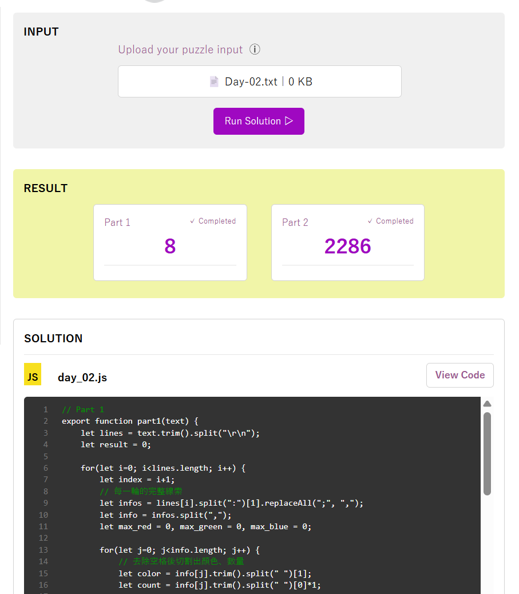

### 專案簡介

<a href="https://adventofcode.com/2023" target="_blank">Advent of Code 2023</a> 解題紀錄。

除了列出每日進度與 Solution 程式碼，也製作簡易的操作介面

供使用者自行上傳 input 文件、執行對應程式以取得結果。

主要使用 **Vue, JavaScript** 開發，採用 SPA (Single Page Application) 架構。





```
ⓘ Advent of Code 是什麼？

這是為了迎接聖誕假期，由工程師所設計的年度解題活動

官網每日 (台灣時間 13:00) 會更新程式題目，需完成第一部分才會開啟第二部分

答出任一部分就可獲得 ⭐ 並解鎖主畫面圖片，前 100 位解出者還可得到積分
```
